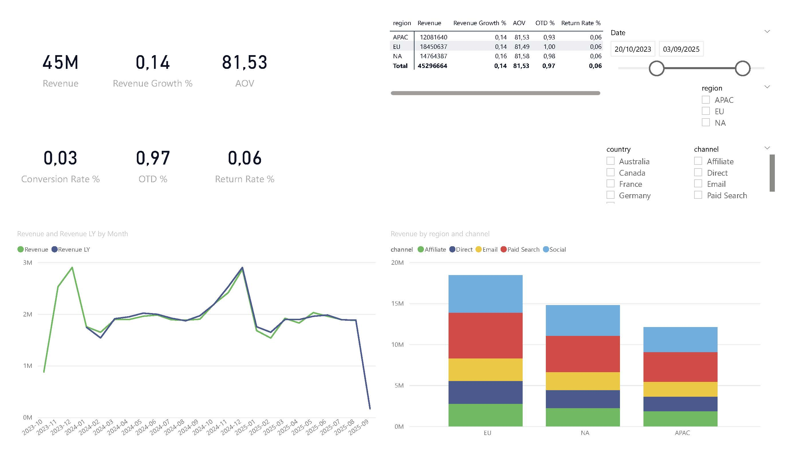
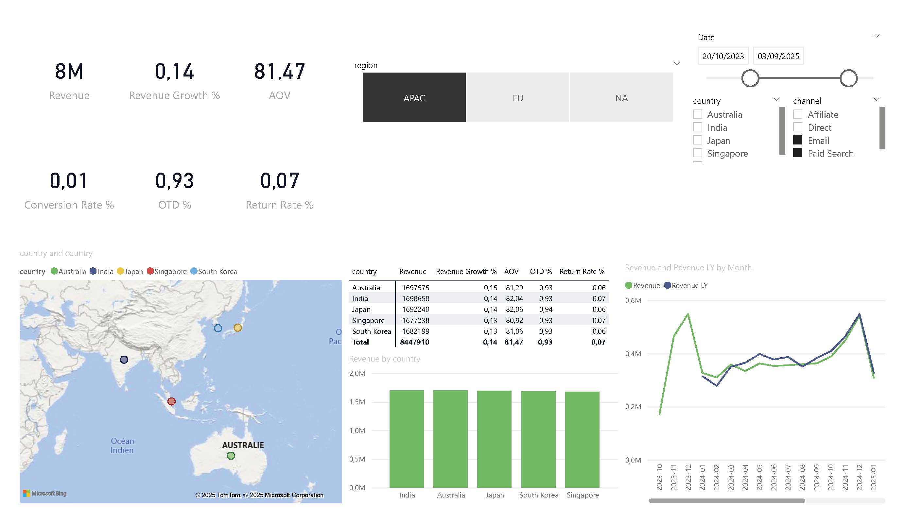
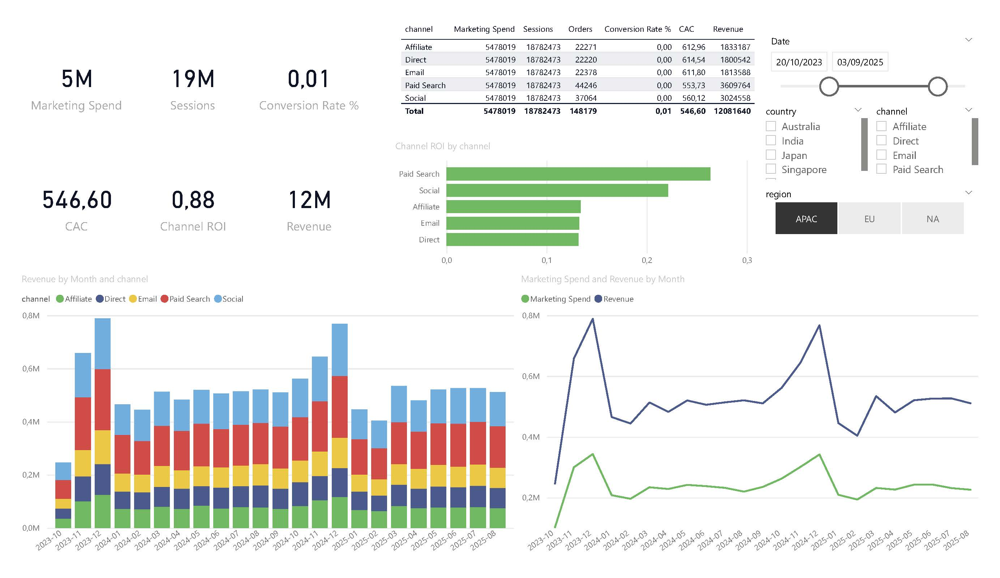
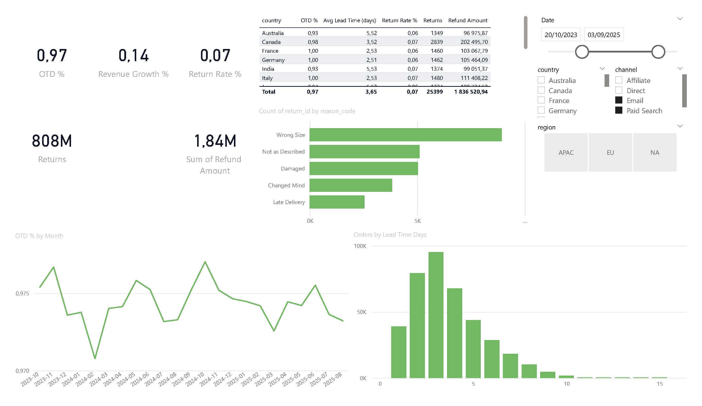
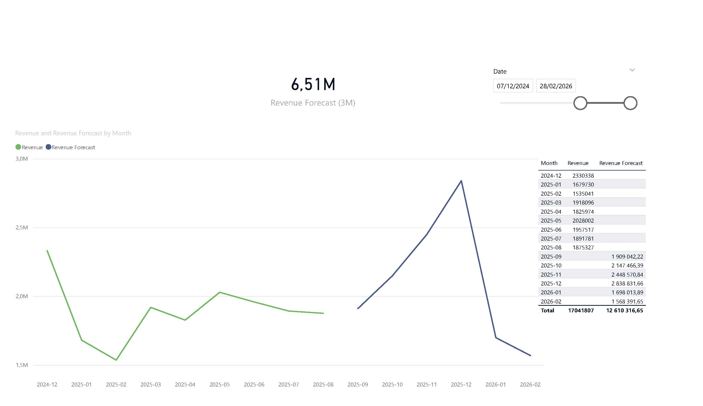

# 🌍 Global E-Commerce BI Dashboard

[]()  
[]()  
[]()

An end-to-end **Business Intelligence project** that transforms synthetic e-commerce data into actionable insights.  
Built with **Power BI, Python, SQL, and DAX** to demonstrate how data analysis drives business decisions.

---

## 📊 Project Overview

This project simulates the role of a **Data Analyst / BI Developer** in a global e-commerce company.

The workflow covers:

- **Data generation & ETL** → Synthetic datasets with customers, orders, returns, and marketing spend.
- **Modeling** → Star schema design, relationships, measures in DAX.
- **Reporting** → Executive KPIs, regional & channel drilldowns, delivery performance, forecasting.
- **Data quality** → Monitoring completeness, duplicates, orphan keys, and anomalies.

---

## 🛠️ Tech Stack

- **Power BI Desktop** → dashboards, DAX measures
- **Python (pandas, statsmodels)** → ETL, Holt-Winters forecasting
- **SQL** → schema & views
- **GitHub** → project portfolio

---

## 📂 Repository Structure

```
ecommerce-bi-forecast/
│
├─ data/
│   └─ raw/                 # Synthetic CSV datasets
├─ etl/
│   └─ generate_synthetic_data.py
├─ model/
│   ├─ forecast_revenue.ipynb
│   └─ forecast_otd.ipynb
├─ powerbi/
│   ├─ Global_Ecommerce_KPI.pbix   # Main dashboard
│   ├─ starter_measures.dax
│   └─ data_quality_measures.dax
└─ docs/
    ├─ README.md             # Documentation
    ├─ case_study.md         # Extended project write-up
    └─ screenshots/          # Exported report pages
```

---

## 📈 Report Pages & Features

### 1️⃣ Executive Overview

- Revenue, AOV, Conversion Rate, OTD %, Return Rate
- Trend line: Revenue vs Last Year
- Breakdown: Revenue by Region & Channel



---

### 2️⃣ Region Drilldown

- Map: Revenue by Country
- Regional KPI cards
- Trend: Regional Revenue vs LY
- Top 5 Countries by Revenue



---

### 3️⃣ Channel Performance

- KPIs: Marketing Spend, Sessions, CAC, ROI
- Revenue by Channel (monthly stacked column)
- Marketing Spend vs Revenue trend
- ROI by Channel table



---

### 4️⃣ Delivery & Returns

- KPIs: OTD %, Avg Lead Time, Return Rate %
- Lead Time Distribution (histogram)
- Returns by Reason Code
- Country-level delivery KPIs



---

### 5️⃣ Forecast Panel

- Revenue Actual + Forecast (Holt-Winters, Python → Power BI)
- OTD % Actual + Forecast
- Forecast summary table (next 6 months)



---

### 6️⃣ Data Quality Dashboard

- Health Score (0–100)
- Completeness heatmap (blank % by field)
- Duplicate keys, orphan returns
- Freshness (days since last data)
- Revenue anomaly detection (spikes/drops)


---

## 🎯 Key Highlights

- 📐 **Star Schema** with fact tables (Orders, Marketing, Returns) + dimension tables (Customers, Date).
- 📊 **30+ DAX measures** for KPIs, growth %, ROI, CAC, anomalies.
- 🔮 **Forecast integration** (Python Holt-Winters → CSV → Power BI).
- ✅ **Data quality checks**: completeness, duplicates, referential integrity, anomaly detection.
- ⚡ **Scenario analysis**: What-If parameter for Marketing Spend uplift.

---

## 🚀 How to Use

1. Clone this repo:
   ```bash
   git clone https://github.com/<your-username>/ecommerce-bi-forecast.git
   ```
2. Open `powerbi/Global_Ecommerce_KPI.pbix` in **Power BI Desktop**.
3. Explore dashboards, slicers, and forecasting features.
4. Or, browse `docs/screenshots/` for static views.

---

👤 **Author**: Firas Sakli
